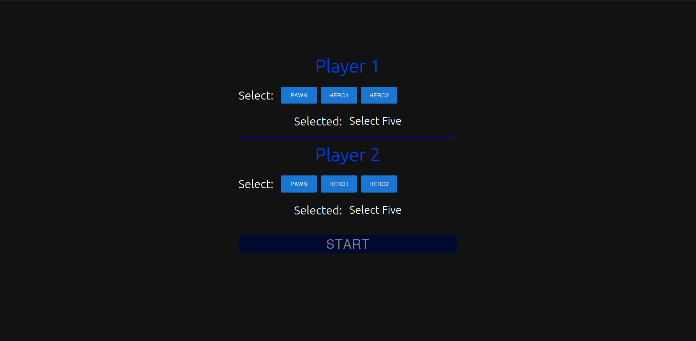
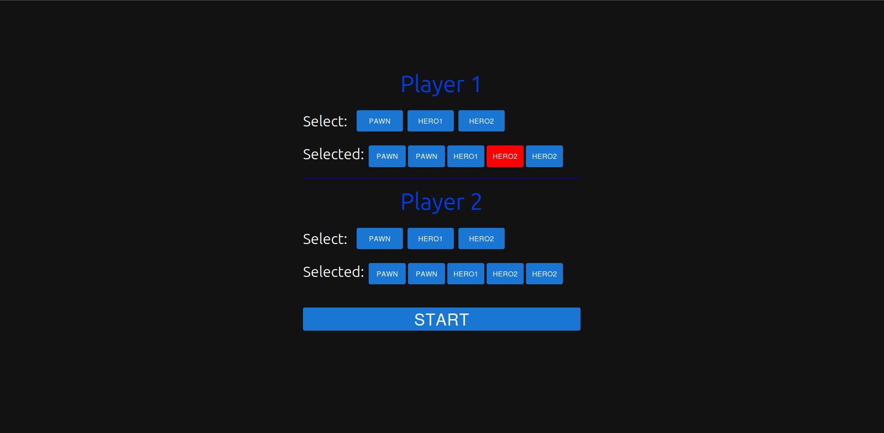
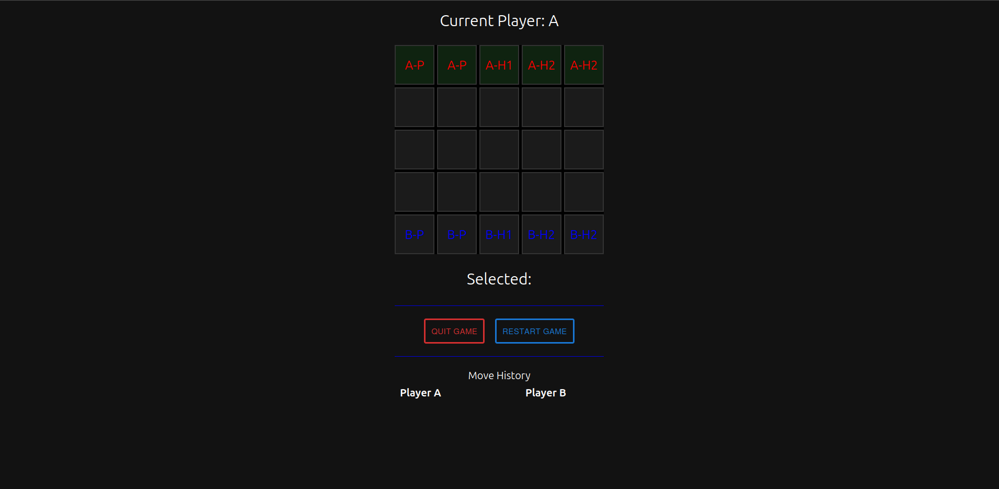
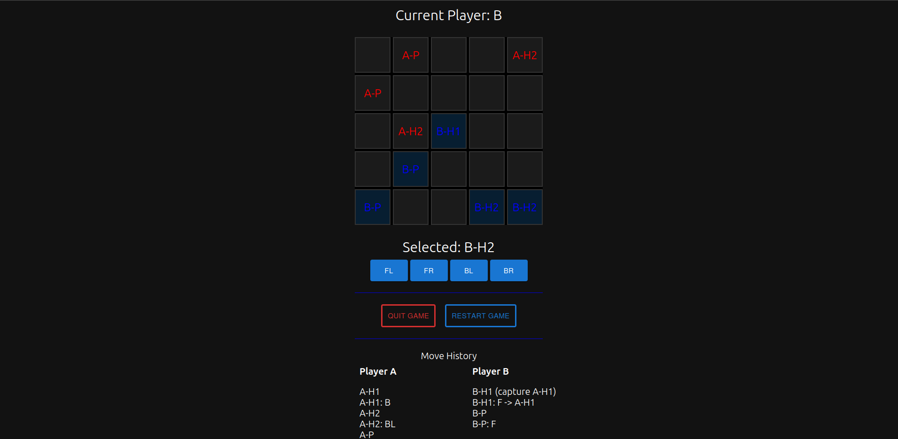
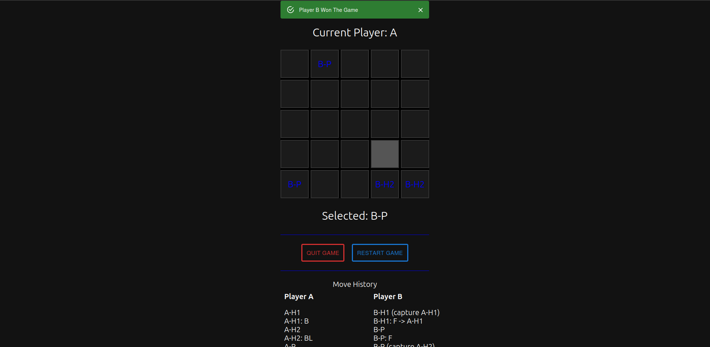

# Multiplayer Turn-Based Game Server

This project is a server-side implementation of a multiplayer turn-based game built using Node.js, Express, and Socket.io. The game involves two players, each controlling a set of characters on a 5x5 board. Players take turns moving their characters, with the goal of capturing all of the opponent's pieces.

## Features

- **Real-time Multiplayer**: Uses Socket.io to manage real-time interactions between players.
- **Turn-Based Mechanics**: Alternating turns between two players, with validation for legal moves.
- **Character Movement**: Different character types with unique movement capabilities.
- **Capture Mechanism**: Players can capture opponent pieces, with the game tracking each player's remaining characters.
- **Game Initialization and Reset**: Supports starting a new game, resetting the game state, and reinitializing the board.
- **Move History**: Keeps track of each player's moves throughout the game.

## Getting Started

### Prerequisites

- **Node.js** (v14+ recommended)
- **npm** (v6+ recommended)

### Installation

1. Clone the repository:
```bash
   git clone https://github.com/yourusername/multiplayer-turn-based-game.git
   cd multiplayer-turn-based-game
```
2. install dependency 
```bash
    cd server
    npm install
``` 
 3. Start the server:
```bash
    npm start
```

## Game Structure
### Game State

- **Board:** A 5x5 grid where characters are placed.
- **Players:** Two players (A and B), each with a set of characters, a move list, and a count of remaining characters.
- **Current Player:** Tracks whose turn it is to move.
- **Started:** A flag indicating whether the game has begun.

### Characters

- **PAWN (P):** Moves one square in any direction.
- **HERO1 (H1):** Moves up to two squares horizontally or vertically, with the ability to capture opponent pieces in its path.
-**HERO2 (H2):** Moves up to two squares diagonally, with similar capturing capabilities as HERO1.

### Game Flow

-**Initialization:** Players connect and choose their characters.
-**Turn Management:** Players take turns moving their characters, with the server validating each move.
 -**Capture Mechanism:** Characters can capture opponent pieces, with the game checking for win conditions after each move.
-**Game End:** The game ends when all of one player's characters are captured, declaring the other player as the winner.

### Socket.io Events

- **initilize:** Initializes the game with the players' characters.
    - **reInitilize:** Resets the game state and reinitializes the board.
    - **selectPlayer:** Updates the player's selected characters.
    - **characterRemove:** Handles the removal of a player's character.
    - **updateMove:** Processes a move request from a player.
    - **refreshGame:** Sends the current game state to a reconnecting client.
    - **gameWon:** Announces the winner when the game ends.
    - **invalidWarning:** Sends a warning if a player makes an invalid move.


# Chess-like Turn-based Client SetUp
## Overview

This is a turn-based strategy game inspired by chess, where two players, Player A and Player B, select characters and engage in a strategic battle on a 5x5 grid board. The game allows real-time multiplayer interaction using Socket.io. Each player must select their characters before starting the game, and they take turns to move their selected characters on the board according to predefined move patterns. The game keeps track of each player's moves and declares a winner when a player meets the winning condition.
Features

-**Real-Time Multiplayer:** Players can join the game and interact in real-time.
    -**Character Selection:** Both players must select 5 characters each before starting the game.
    -**Turn-Based Gameplay:** Players take turns to move their characters on the board.
    -**Move Validation:** The game ensures that only valid moves are executed.
    -**Move History:** Displays the history of moves for each player.
    -**Game Restart & Quit:** Players can restart or quit the game anytime.

## Technologies Used

-**React.js:** For building the user interface.
    -**Socket.io:** For real-time communication between the server and clients.
    -**Node.js:** Backend server to handle game logic and socket connections.
    -**Material-UI:** For styled components and UI elements.

## Setup Instructions
### Prerequisites

   - **Node.js** (v14+ recommended)
    - **npm** (v6+ recommended)

### Installation

1. Clone the repository:
```bash
git clone https://github.com/your-username/your-repo-name.git
cd your-repo-name
```

2. Install dependencies:

```bash
cd client
npm install
```
3. Start the server:
```bash
npm start
```
4. Open a web browser and go to http://localhost:3000.

## How to Play

-**Character Selection:-**
        Player 1 and Player 2 select their characters by clicking on the character buttons.
        Each player must select exactly 5 characters to proceed.

-**Start the Game:**
        Once both players have selected their characters, click the "Start" button to begin the game.

-**Taking Turns:**
        Players take turns moving their characters on the board.
        Click on a character to select it, and then choose the direction of the move from the available options.
        The game will automatically update the board and switch turns.

-**Winning the Game:**
        The game continues until a player meets the winning condition (e.g., capturing a key piece).

-**Restart or Quit:**
        Players can restart the game or quit at any time using the provided buttons.

### Game Logic

 -**Characters:**
        -***Pawn (P):*** Can move in four directions (Left, Right, Forward, Backward).
        -***Hero1 (H1):*** Can move in the same directions as Pawn.
        -***Hero2 (H2):*** Can move diagonally (Forward Left, Forward Right, Backward Left, Backward Right).

-**Move Validation:**
        The game only allows valid moves based on the character's movement rules.
        The move history is updated after each valid move.

-**Move History:**
        The move history for each player is displayed on the game interface, showing the sequence of moves made during the game.

### Screenshots







## Future Enhancements
    Add more characters with unique movement patterns.
    Implement a ranking system for players.
    Enhance the UI with more interactive and animated elements.

## Contributing
Contributions are welcome! Please fork the repository and create a pull request for any improvements or bug fixes.
License

If you have any questions or feedback, feel free to contact me at abhishek.abhi172126@gmail.com.